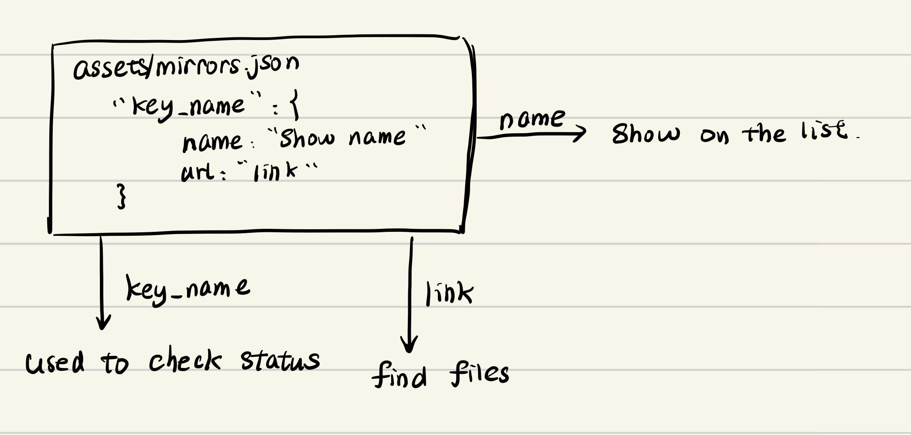

# PKU Mirror 前端

## 如何添加

### 如何添加到Mirrors

修改`/src/assets/mirrors.json`



在`data`字段下添加如下格式的内容:

``` json
"Name": {
  "url": 仓库地址
}
```

### 如何添加到Help

1. 在`/src/components/help`下新建`帮助.vue`

> `帮助`将作为内部索引及地址栏参数，帮助显示名称在文件内由`name`另行指定

2. 参考Ubuntu.vue为模板

> 注意markdown文件可放置在`/static/help/`下通过axios获取

### 如何建立Mirror和Help的关系

参考"如何添加到Mirrors"

```
"Name": {
  "url": 仓库地址,
  "help": 帮助的内部索引
}
```

## 编译

安装依赖: `npm install`

编译: `npm run build`

## TODO

- [x] Fancy index
- [x] Status page
- [ ] System Download Page
- [ ] Dark mode
- [ ] Multi language
- [ ] Backend control panel.
